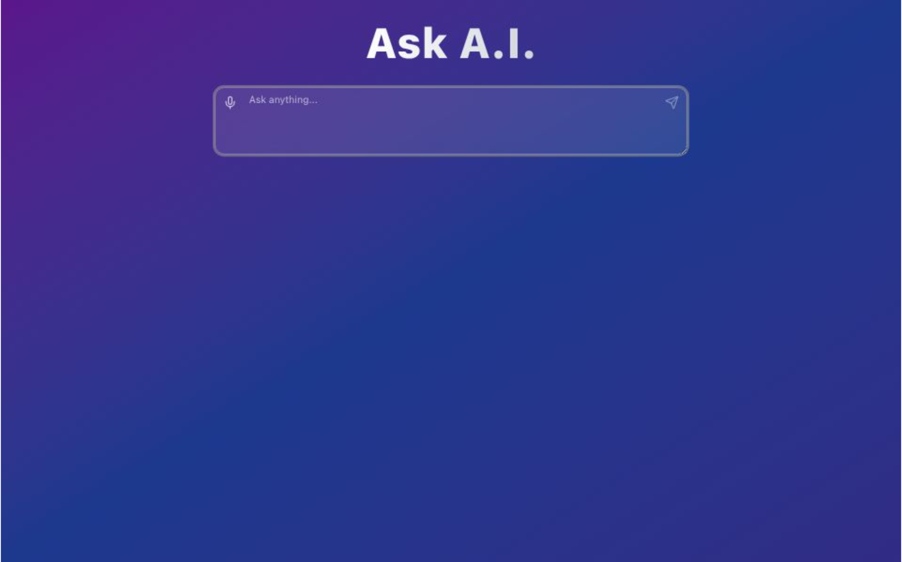

# Ask A.I.

Ask A.I. is a lightweight Next.js app that lets you ask questions by typing or using speech-to-text and receives Markdown-formatted answers from a backend AI API. Answers are typed out with a fast typewriter effect and rendered as Markdown.

## Features

- Type or speak your question (Web Speech API)
- Submit by pressing `Ctrl+Enter` (or `Cmd+Enter` on macOS) or the Send button
- Speech recognition final results are appended to the textarea and automatically submitted when recognition ends
- Answers are received as Markdown and rendered using `react-markdown` + `remark-gfm`
- Fast typewriter playback of answers; conversation history is kept (newest first)
- Keyboard shortcuts: `Ctrl+Enter` submit, `Esc` clear the textarea; blank submits will refocus the textarea

Made with ❤️ — ask a question and enjoy the answers.
